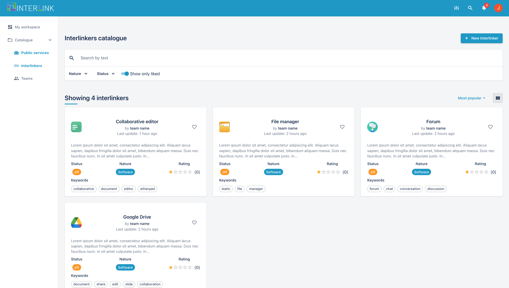

<div id="top"></div>

<!-- PROJECT LOGO -->
<br />
<div align="center">
  <a href="https://github.com/interlink-project/frontend">
    
  </a>

  <h3 align="center">Interlink collaborative environment frontend</h3>

  <p align="center">
    React frontend that integrates and orchestrates all components related to the project
    <br />
    <a href="https://interlink-project.eu/"><strong>View Interlink project »</strong></a>
    <br />
    <br />
    <a href="https://github.com/interlink-project/frontend/issues">Report Bug</a>
    ·
    <a href="https://github.com/interlink-project/frontend/issues">Request Feature</a>
  </p>
</div>


<!-- TABLE OF CONTENTS -->
<details>
  <summary>Table of Contents</summary>
  <ol>
    <li>
      <a href="#about-the-project">About The Project</a>
      <ul>
        <li><a href="#built-with">Built With</a></li>
      </ul>
    </li>
    <li>
      <a href="#getting-started">Getting Started</a>
      <ul>
        <li><a href="#prerequisites">Prerequisites</a></li>
        <li><a href="#installation">Installation</a></li>
      </ul>
    </li>
    <li><a href="#usage">Usage</a></li>
    <li><a href="#contributing">Contributing</a></li>
  </ol>
</details>


<!-- ABOUT THE INTERLINKER -->
## About the Interlinker



This frontend is intended to be the graphical interface with which the users of the "collaborative environment" defined by the project interact.

<p align="right">(<a href="#top">back to top</a>)</p>


### Built With
* [Create React App](https://create-react-app.dev/)
* [Docker-compose](https://docs.docker.com/compose/)

<p align="right">(<a href="#top">back to top</a>)</p>


<!-- GETTING STARTED -->
## Getting Started

To get a local copy up and running follow these simple example steps.

1. Rename *.env.example* file to *.env* and set required data

### Without docker:
2. Navigate to the path that contains the react application
   ```sh
    cd react
   ```
3. Install the dependencies
   ```sh
    npm i
   ```
4. Run the application
   ```sh
    npm run start
   ```
   

### With docker:
2. Run the application
   ```sh
    docker-compose up --build
   ```
   or if images created already:
   ```sh
    docker-compose up
   ```


<p align="right">(<a href="#top">back to top</a>)</p>


<!-- CONTRIBUTING -->
## Contributing

Contributions are what make the open source community such an amazing place to learn, inspire, and create. Any contributions you make are **greatly appreciated**.

If you have a suggestion that would make this better, please fork the repo and create a pull request. You can also simply open an issue with the tag "enhancement".

1. Fork the Project
2. Create your Feature Branch (`git checkout -b feature/AmazingFeature`)
3. Commit your Changes (`git commit -m 'Add some AmazingFeature'`)
4. Push to the Branch (`git push origin feature/AmazingFeature`)
5. Open a Pull Request

<p align="right">(<a href="#top">back to top</a>)</p>