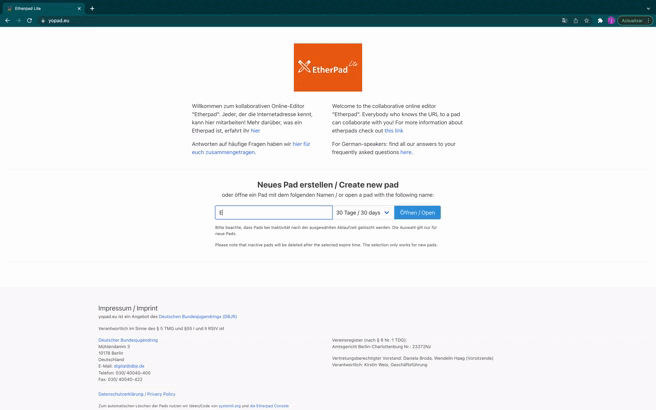
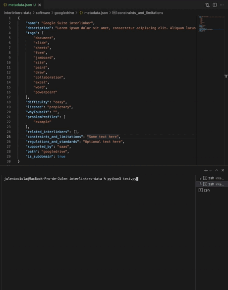

# Interlinkers data

**Current version status:**

[](https://github.com/interlink-project/interlinkers-data/actions/workflows/run-test.yml)

In here we will indicate the steps to follow to create a BUNDLE for a KNOWLEDGE INTERLINKER that can be imported directly by the INTERLINKER catalogue

The schemas implemented are based on what have been discussed here: 

https://docs.google.com/spreadsheets/d/1tJ2BfX4EOdbBqEbrJWg8a3MENw13vYiPZM_S4wWWgWQ/edit


# For users
The way to add new interlinkers is to create a new directory that follows the structure defined by the example.
 
* A "metadata.json" file in the root of the directory.
* Optionally, a directory called "snapshots" can be created to store the images corresponding to the interlinker. The order may be important; use digits to orther them (image1, image2, image3...)

```
├── base.py
├── knowledge
│   ├── example_knowledge_interlinker
│   │   ├── doc.docx
│   │   ├── instructions.md
│   │   ├── metadata.json
│   │   └── snapshots
│   │       ├── image1.jpeg
│   │       └── image2.jpeg
│   ├── schema.json
│   └── schema.py
├── software
│   ├── googlesuite
│   │   ├── metadata.json
│   │   └── snapshots
│   │       ├── image1.jpeg
│   │       └── image2.jpeg
│   ├── schema.json
│   └── schema.py
└── test.py
```

## Adding new interlinker

In the case of adding a new knowledge interlinker, the following sections must be included in the metadata.json:

```yaml
{
    "name":                         free text
    "description":                  free text (could be HTML formatted text)
    "tags":                         array of free text
    "difficulty":                   "very_easy", "easy", "medium", "difficult" or "very_difficult"
    "licence":                      "public_domain", "permissive", "copyleft", "non_commercial" or "propietary"
    "problem_profiles":              array of free text
    "related_interlinkers":         array of free text
    "constraints_and_limitations":  free text
    "regulations_and_standards":    optional text
    "form":                         "visual_template", "document_template", "canvas", "best_practices", "guidelines", "checklist", "survey_template", "legal_agreement_template" or "other"
    "format":                       "pdf", "editable_source_document", "open_document" or "structured_format"
    "instructions":                 valid path to HTML or MD file
    "file":                         valid path to file
    "softwareinterlinker":     "googledrive", "survey", "ceditor"
}
```

For example:
```json
{
    "name": "Example knowledge interlinker",
    "description": "<p class=\"fg-white\">Lorem ipsum dolor sit amet, consectetur adipiscing elit. Aliquam lacus sapien, dapibus fringilla dolor sit amet, bibendum aliquam massa. Duis nec faucibus nunc. In sit amet vulputate justo. In dictum turpis eu dolor posuere vehicula</p>",
    "tags": [
        "skeleton",
        "aim",
        "project"
    ],
    "difficulty": "easy",
    "licence": "propietary",
    "problem_profiles": [
        "example"
    ],
    "related_interlinkers": [],
    "constraints_and_limitations": "Some text here",
    "regulations_and_standards": "Optional text here",
    "form": "visual_template",
    "format": "editable_source_document",
    "instructions": "./knowledge/example_knowledge_interlinker/instructions.md",
    "file": "./knowledge/example_knowledge_interlinker/doc.docx",
    "softwareinterlinker": "googledrive"
}
```

For now, there are only these few software interlinkers you could use:

* Google Drive:
    * **file:** path to a file, such as .docx, .ppt, .xlsx, .pdf... anything that google drive could work with.
    * **softwareinterlinker:** "googledrive"

* Survey

    * **file:** go to https://surveyjs.io/create-survey-v2, create a survey and copy the data that appears in the "JSON Editor" tab. Then, create a file with ".json" extension and copy the contents copied. File attribute should point to the path of this file you just created.

        

    * **softwareinterlinker:** "survey"

* Collaborative editor:

    * **file:** you have several options:
    
        * Go to https://yopad.eu, create a pad and download the data as Etherpad / HTML / Microsoft Word or ODF. Then, move that file to the folder and set the path of the file attribute.

            

        * Set the path of the file attribute to an already existing .doc / .docx document.

    * **softwareinterlinker**: "ceditor"

        
## How to validate data

Enter
https://www.jsonschemavalidator.net/


If you want to check metadata for a knowledge interlinker, open /knowledge/schema.json file and copy its content into the left part. Now, copy the metadata.json into the right part.


Incorrect metadata.json (tags length < 1)


> :warning: **Paths of files are not validated with this method**: Be very careful here!

# For developers


## What is pydantic?

Pydantic is a useful library for data parsing and validation. It coerces input types to the declared type (using type hints), accumulates all the errors using ValidationError & it’s also well documented making it easily discoverable.

### Basic examples
```yaml
Free text:               str
Whole number:            int
Decimal:                 float
Boolean:                 bool
Optional text:           Optional[str]
List of texts:           List[str]
Optional array of texts: Optional[List[str]]
```

```py
class Schema(BaseModel):
    name: str
    description: Optional[str]
    tags: List[str]
```

### Enumerations

```py
class Difficulties(Enum):
    very_easy = "very_easy"
    easy = "easy"
    medium = "medium"
    difficult = "difficult"
    very_difficult = "very_difficult"

class Schema(BaseModel):
    difficulty: Difficulties
```

Now difficulty can only be one of the values specified in the enum

### Conditionals:

conbytes, condecimal, confloat, conint, conlist, conset, constr

```py
class Schema(BaseModel):
    tags: conlist(str, min_items=1)
```

### Custom validators

Override a validator for a given attribute. For example, you can validate that the path contained in the file attribute is actually a file:

```py
class Schema(BaseModel):
    value: str

    @validator("value")
    def example_value_validator(cls, v):
        if not value in ["example", "value"]:
            raise ValueError(
                f"{file} does not exist. Example: example_knowledge_interlinker/resources/doc.docx"
            )
        return v

```

### Nested objects

```py
class File(BaseModel):
    name: str
    path: str
    thumbnail: Optional[str]

class Schema(BaseModel):
    name: str
    file: File
    
```

```json
{
    "name": "example",
    "file": {
        "name": "filename",
        "path": "/home/doc.docx",
        "thumbnail": "/home/logo.png"
    }
}
```

### How to validate data
```py
data = {
    "name": "...",
    "description": "...",
    "tags": [ ... ],
    ...
}

Schema(**data)
# if not valid, raises exception
```


### Extra attributes forbidden 

If the schema is instantiated with more attributes than specified in it, it fails

```py
from pydantic import BaseModel, Extra

data = {
    "name": "example",
    "description": "description",
    "image": "image"
}
class InterlinkerSchema(BaseModel, extra=Extra.forbid):
    name: str
    description: str

InterlinkerSchema(**data)

```
Raises:
```
pydantic.error_wrappers.ValidationError: 1 validation error for InterlinkerSchema
image
  extra fields not permitted (type=value_error.extra)
```

> Take a look at pydantic documentation for more field types: https://pydantic-docs.helpmanual.io/usage/types/


## Interlinker schemas

### Base interlinker schema

This scheme defines the common properties for software and knowledge interlinkers. It is located in the root of the repository with the name of "base.py".

./base.py

Defines these attributes:

* name
* description
* tags
* difficulty
* targets
* problem_profiles
* types
* related_interlinkers
* administrative_scope
* domain
* process
* constraints_and_limitations
* regulations_and_standards
* overview_text

(Some of them are not required for the first phase, so are marked as optional)

### Knowledge interlinker schema

/knowledge/schema.py

Extends the base with these attributes:
* file
* form
* format
* instructions
* softwareinterlinker

### Software interlinker schema

/software/schema.py

Extends the base with these attributes:
* supported_by
* auth_method
* deployment_readme
* user_manual
* developer_manual
* supports_internationalization
* is_responsive
* open_in_modal
* assets_clonable
* path
* is_subdomain


## Testing

To test that all the interlinkers (directories) and their metadata are valid, a script called "test.py" is provided, which in addition to validating the metadata, creates a file "schema.json" at the height of "schema.py" that users can use to quickly validate if the metadata is correct, without having to use python at all, as can be seen in "For users" section.

#### Install the dependencies:
```sh
pip3 install pydantic
```

#### Run the script:
```sh
python3 test.py
```




### Github action to test on versions push

```yaml
jobs:
  build:
    runs-on: ubuntu-latest
    steps:
      - name: checkout repo content
        uses: actions/checkout@v2 # checkout the repository content to github runner.
      - name: setup python
        uses: actions/setup-python@v2
        with:
          python-version: 3.8 #install the python needed
      - name: Install dependencies and run test script
        run: |
          python -m pip install --upgrade pip
          pip3 install pydantic
          python test.py
```