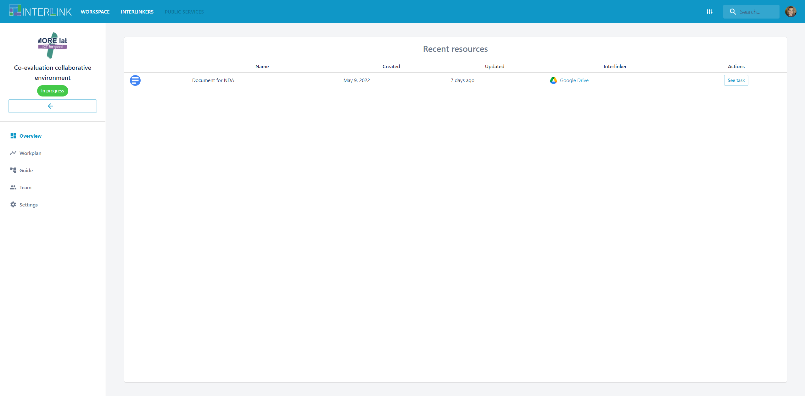

# Guide view of a coproduction process

The GUIDE view can be considered the main view of a co-production process. It is closely linked to the other available views, namely [OVERVIEW](/docs/en/coproductionprocess-overview.html) and [WORKPLAN](/docs/en/coproductionprocess-workplan.html) views of a co-production process. 

The [GUIDE view](/docs/en/coproductionprocess-guide.html) displays a co-production tree, allowing the co-production team members to browse through the phases of a co-production process, its corresponding objectives, the tasks that help accomplishing those objectives and the INTERLINKERs that are recommended to aid team member completing certain tasks of the co-production process. Very importantly, from the GUIDE view, users can instantiate the recommended INTERLINKERs for a task or create new instances from a range of generic INTERLINKERs.

After creating a new co-production process, the user is requested to choose a co-production process guide. Notice that there is flexibility to choose the best fitting schema (you may check available co-production schemas in our [interlinkers-data/schemas](https://github.com/interlink-project/interlinkers-data/tree/master/schemas) repo). The left-hand-side "Guide" menu item does not appear until a schema has been chosen.

Notice that there are several co-production trees available. Let's select, for instance, ["Default schema"](https://github.com/interlink-project/interlinkers-data/tree/master/schemas/default) 

As result, notice the emergence of Guide view menu item on left hand side 

Some of the actions that you may carry in the GUIDE view are: 
   - You may customize such tree to the specific needs of your co-production process. Currently only DELETE task allowed, soon you will be able to add new objectives & tasks. Check below how a task is removed after having clicked on the PENCIL icon which appears on the right hand side of the task visualization panel.
   
   
   - Observe that specific co-production trees can be defined and, hence, selected (e.g. [VARAM case](https://github.com/interlink-project/interlinkers-data/tree/master/schemas/servicedescriptionenhancement))
   - You may also assign durations to tasks
   
   - Then, we can see in [WORKPLAN view](/docs/en/coproductionprocess-workplan.html) the time span defined, by clicking on the "Time planification" link in the [GUIDE view](/docs/en/coproductionprocess-guide.html) or clicking on the left hand side menu option named "Workplan". You may return to the Guide view, to see the task details by clicking on the name of the task in the WORKPLAN view. 
   
   
   
The GUIDE view allows to instantiate INTERLINKERs to, hence, make progress in the co-production process. For each of the tasks in the co-production phases you may select any of the recommended INTERLINKERs or instantiate a new one based on the generic software INTERLINKERs available at the bottom of the screen shown when selecting a co-production task. 

For intance, let's create a new document to collect feedback of collaboration process.
- Select a task in the GUIDE view, e.g. ENGAGE > Engage Stakeholders > Create awareness and Communication
- Notice the INTERLINKERs recommended
	
- Select a task in the GUIDE view, e.g. ENGAGE > Define legal and ethical framework > Define a non-disclosure agreement (NDA)
- Click on the blue button at the bottom entitled "Initiate Procedure" to give place to a new Google Docs document
	
- Select the type of document to create with the support of Google Drive INTERLINKER
	
- Realize about the new resource that appears at the bottom of the task description panel
	
- Open it in Google Drive by clicking on the newly created resource name
	
- You may repeat the process, selecting a recommended INTERLINKER instead:
	- For instance, select *"Stakeholders Mapping Canvas"* INTERLINKER under task shown when navigating to *Engage > Identify Stakeholders*  
	- Click on button “Instantiate as resource to use in the project”
	- Check the newly created resource appears at the bottom of the page under **“Current resources”**
	- Open the generated resource in the form of a presentation and add some modifications
	
Finally, you can see the progress achieved, so far, in a given co-production process by visiting the [OVERVIEW view](/docs/en/coproductionprocess-overview.html), by clicking on "Overview" menu item on the left hand-side menu option.
	
	
