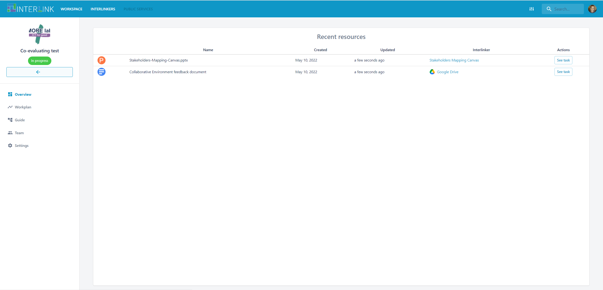
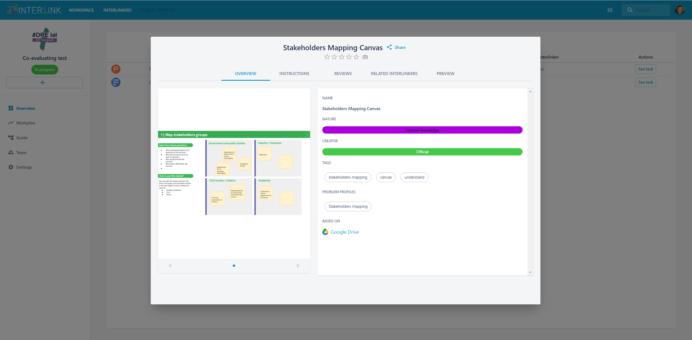
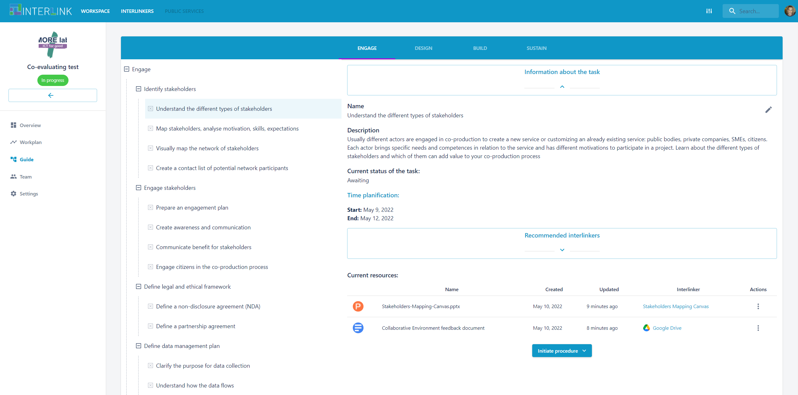
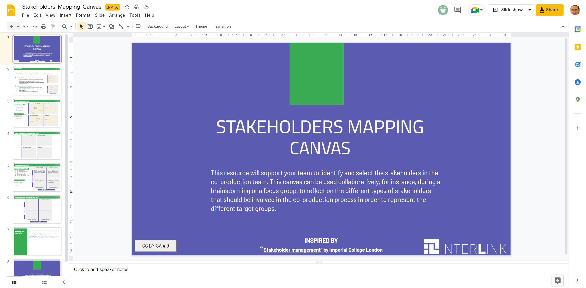

# Overview of a co-production process

The Overview view is one of the three co-production process visualization available, namely [Overview](/docs/en/coproductionprocess-overview.html#), [Guide](/docs/en/coproductionprocess-guide.html) and [Workplan](/docs/en/coproductionprocess-workplan.html) views.  

The Overview view is in charge of showing the ongoing activity on a given co-production process. It displays the current set of resources instantiated. The following actions can be performed over the resources listed:
- Visit the INTERLINKER with which such resources are being created, by clicking on the link with the name of the INTERLINKER.
- Visit the task a given resource has been created with, by clicking on "See task" button. 
- Open the corresponding resource by clicking on the hyperlinked name of the resource. 

