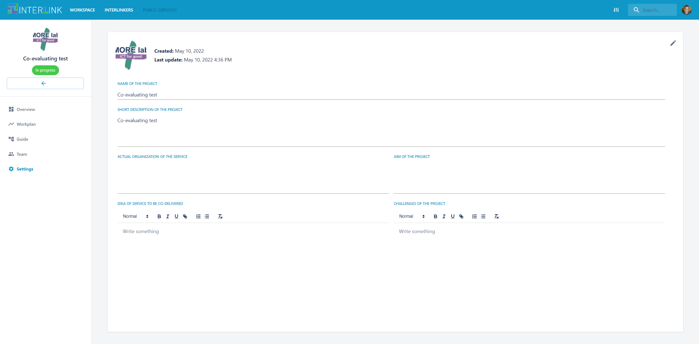
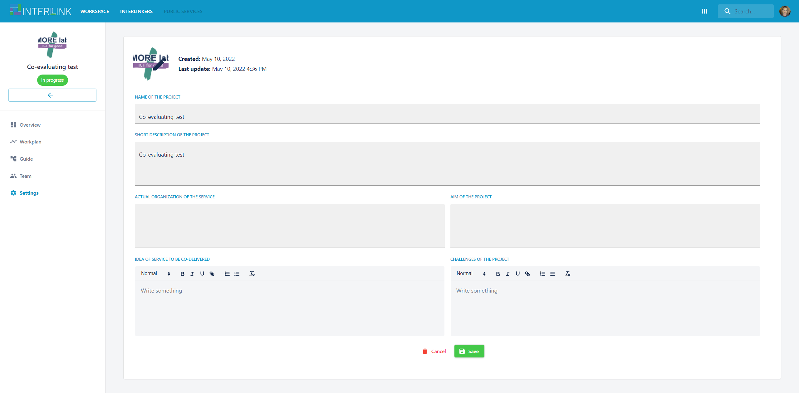

# Settings a co-production process

Once you have configured a co-production process, you can always update its details by clicking on the **Settings** menu option on the left hand-side menu. Then, click on the PENCIL icon on the top right hand side to start editing the project details. Finally, hit on the button "Save" to save changes or "Cancel" to cancel them. 

The following details can be updated per project:
- Logo of the project
- Name of the project 
- Short description of the project
- Actual organization of the service
- Aim of the project
- Idea of service to be codelivered
- Challenges of the project

As we can see, this section allows for the definition of the purpose of a project, establishing how will be managed and what challenges it will need to solve. 

