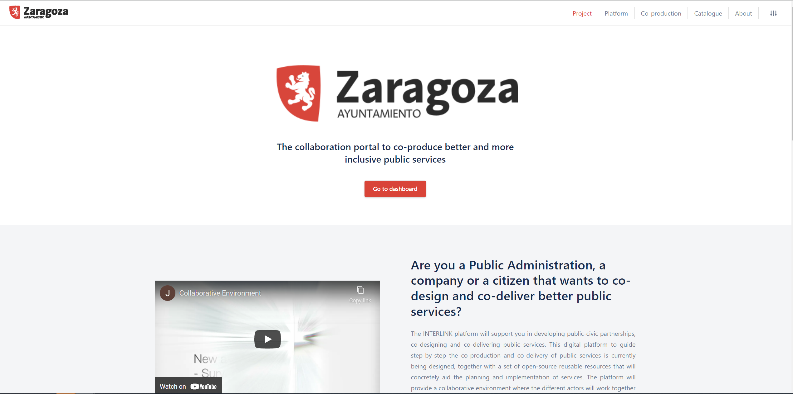
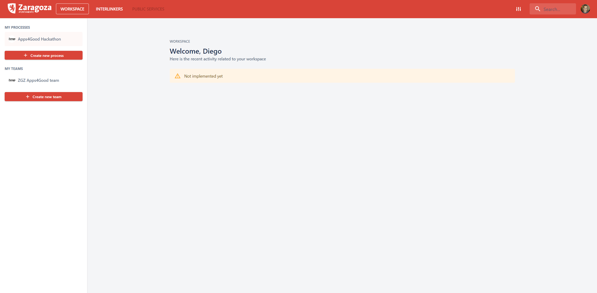

# Dashboard

When a user accesses one to the INTERLINK collaborative front-end encounters a page informing about:
- [INTERLINK project](https://demo.interlink-project.eu/) (top menu option "Project")
- The [Platform](https://demo.interlink-project.eu/platform) ("Platform" top menu option) giving details about the Collaborative Environment made available by the project
- The INTERLINK [co-production methodology](https://demo.interlink-project.eu/coprod) ("Co-production" top menu option)
- The [INTERLINKERs catalogue](https://demo.interlink-project.eu/catal) ("Catalogue" menu option) where unregistered users can browse, filter and search over available INTERLINKERs
- The [About](https://demo.interlink-project.eu/about) page ("About" menu option") where users can learn about the INTERLINK project. 

When a user clicks on button ["Go to dashboard"](https://demo.interlink-project.eu/dashboard) it will be given access to the INTERLINK Collaborative Environment front-end.

**IMPORTANT**. You may use INTERLINK's deployment at [Staging Server](https://demo.interlink-project.eu/), or, alternatively, you may access the Collaborative Environment's Dashboard in your pilot server:
- [MEF pilot's deployment of Collaborative Environment](https://mef.interlink-project.eu/)
- [VARAM pilot's deployment of Collaborative Environment](https://varam.interlink-project.eu/)
- [Zaragoza pilot's deployment of Collaborative Environment](https://zgz.interlink-project.eu/)

Before using the Collaborative environment, for first time, you must first login with your google credentials or create your own credentials at [https://demo.interlink-project.eu/](https://demo.interlink-project.eu/), i.e. the staging server of INTERLINK. **IMPORTANT**: All members of an envisaged team must logged into the platform before they can be added to a team.  

Once logged in, you are given access to the INTERLINK Dashboard view, where the user has access to two core main functionalities:
- My teams: the user can see the teams s/he is part of and create new co-proction teams if needed.
- My processes: the user can see the co-production processess where s/he is taking part in or create new co-production processes if needed.

Within "My Teams" section, once a user hits "+ Create new team", s/he is shown a pop-up window where a new team details (Name, Description and list of team members) can be input.

Within "My processes" section, once a user hits "+ Create new process", s/he is shown a pop-up window where a new team details (Name, Language, Description) can be input.

By clicking on the name of a co-production process, the user is switched to the ["co-production process" view](/docs/en/coproductionprocess-guide.html). 
